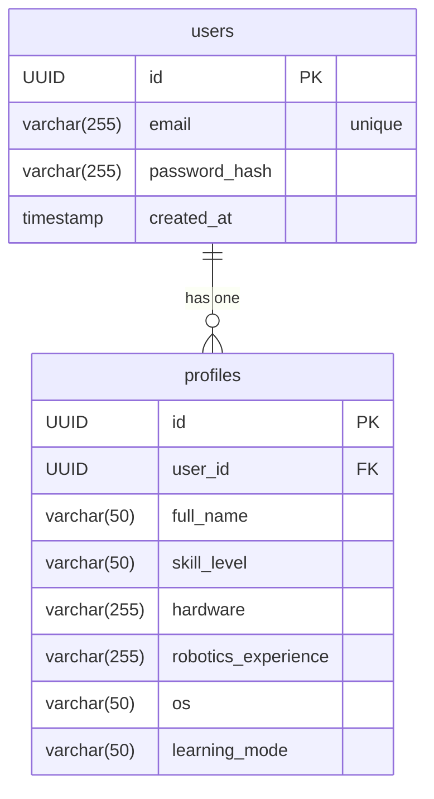

# Data Model: Authentication System

**Branch**: `003-auth-system` | **Date**: 2025-12-09 | **Spec**: [spec.md](./spec.md)

This document defines the data entities and their relationships for the Authentication System, based on the feature specification. The chosen storage solution is Neon Serverless Postgres.

## Entity Relationship Diagram (ERD)

A simple one-to-one relationship exists between the `users` and `profiles` tables. Each user has exactly one profile.

## Table Schemas

### 1. `users`

Stores the core authentication credentials for a user.

| Column          | Data Type      | Constraints                     | Description                                  |
|-----------------|----------------|---------------------------------|----------------------------------------------|
| `id`            | `UUID`         | `PRIMARY KEY`, `DEFAULT gen_random_uuid()` | The unique identifier for the user.          |
| `email`         | `VARCHAR(255)` | `NOT NULL`, `UNIQUE`            | The user's email address, used for login.    |
| `password_hash` | `VARCHAR(255)` | `NOT NULL`                      | The hashed and salted password.              |
| `created_at`    | `TIMESTAMP`    | `NOT NULL`, `DEFAULT NOW()`     | The timestamp when the user account was created. |

### 2. `profiles`

Stores the supplementary background and preference information for a user.

| Column                | Data Type      | Constraints        | Description                                           |
|-----------------------|----------------|--------------------|-------------------------------------------------------|
| `id`                  | `UUID`         | `PRIMARY KEY`      | The unique identifier for the profile.                |
| `user_id`             | `UUID`         | `NOT NULL`, `FOREIGN KEY (users.id)` | Links the profile to a user.                          |
| `full_name`           | `VARCHAR(255)` | `NULL`             | The user's full name.                                 |
| `skill_level`         | `VARCHAR(50)`  | `NULL`             | User's self-reported skill level (e.g., 'Beginner').  |
| `hardware`            | `VARCHAR(255)` | `NULL`             | User's available hardware (e.g., 'GPU, Raspberry Pi'). |
| `robotics_experience` | `VARCHAR(255)` | `NULL`             | User's self-reported robotics experience.             |
| `os`                  | `VARCHAR(50)`  | `NULL`             | User's primary operating system (e.g., 'Windows').    |
| `learning_mode`       | `VARCHAR(50)`  | `NULL`             | User's preferred learning mode (e.g., 'Video').       |

## Data Validation Rules

- **Email**: Must be a valid email format and must be unique within the `users` table.
- **Password**: While not a data model constraint, the application layer will enforce password strength requirements (e.g., minimum length, character types) before hashing.
- **Foreign Key**: The `profiles.user_id` must always correspond to a valid `users.id`. Cascade on delete should be configured to remove a profile if the corresponding user is deleted.
